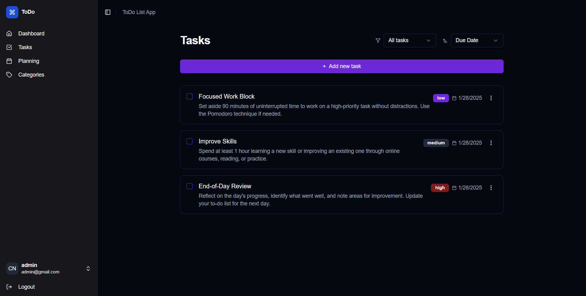

# ToDoList



ToDoList is a task management application built with Next.js and Tailwind CSS. It is designed to help you organize and track daily tasks with a simple and intuitive interface.

## ✨ Features

- ✅ **Add Tasks**: Easily add new tasks.
- ❌ **Delete Tasks**: Remove completed or unnecessary tasks.
- 🔄 **Mark as Done**: Mark tasks as completed to track your progress.
- 🌗 **Dark/Light Mode**: Switch between dark and light mode based on your preference.
- 📱 **Responsive**: Fully responsive interface that works on various devices.

## 🛠 Tech Stack

- **Framework**: [Next.js](https://nextjs.org/)
- **Styling**: [Tailwind CSS](https://tailwindcss.com/)
- **Programming Language**: [TypeScript](https://www.typescriptlang.org/)


## 🚀 Installation & Running Locally

Follow these steps to run the project locally:

### 1️⃣ Clone the Repository

```bash
git clone https://github.com/0xSyam/ToDoList.git
```

### 2️⃣ Navigate to the Project Directory

```bash
cd ToDoList
```

### 3️⃣ Install Dependencies

```bash
npm install --force
```

### 4️⃣ Start the Development Server

```bash
npm run dev
```

> Open [http://localhost:3000](http://localhost:3000) in your browser to view the application.

## 🤝 Contributions

Contributions are welcome! If you have ideas for new features or find any bugs, feel free to open an issue or submit a pull request.

## 📜 License

This project is licensed under the [MIT License](https://choosealicense.com/licenses/mit/).
